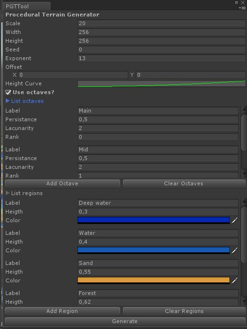

# Procedural Terrain Generator Tool (PTGTool)

Um asset para unity para criação de terreno procedural usando mesh

* Uso opcional de octaves
* Customização de octaves
* Customização de biomas
* Ajuste de offset
* Possibilidade de fornecer um seed
* Curva de profundidade com curve animation
* Salva o terreno gerado como prefab

### [Vídeo](https://youtu.be/kaV69_r9UUk) demonstrando processo de importação e algumas funcionalidades da ferramenta

### [Material de referência](https://www.redblobgames.com/maps/terrain-from-noise/)

### Código adaptado do [tutorial](https://github.com/SebLague/Procedural-Landmass-Generation/tree/master/Proc%20Gen%20E06) do Sebastian Lague, aula 06
